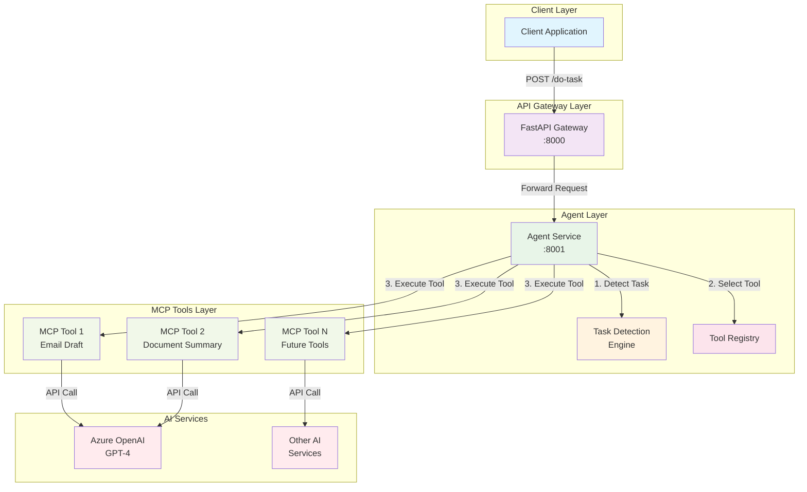

# Nablax Backend - 基于 MCP 的智能任务处理服务

## 项目简介

Nablax Backend 是一个基于 **Model Context Protocol (MCP)** 的智能任务处理服务，具备自动任务识别和工具选择能力。系统采用微服务架构，通过 MCP 协议集成多种 AI 工具，提供统一的 REST API 接口。

## 核心特性

- **🎯 智能任务识别**：自动检测任务类型，无需手动指定
- **🔧 MCP 工具生态**：基于 MCP 协议的可扩展工具系统
- **🚀 统一 API 接口**：单一 `/do-task` 端点处理所有任务
- **🔄 自动故障转移**：完善的 fallback 机制
- **📊 实时监控**：健康检查和调试接口
- **🔒 企业级部署**：支持 Azure OpenAI 和私有部署

## 系统架构



## 服务架构

| 服务             | 端口  | 职责                    | 技术栈       |
|------------------|-------|------------------------|-------------|
| FastAPI Gateway  | 8000  | API 网关，请求路由      | FastAPI     |
| Agent Service    | 8001  | 任务识别，工具选择      | FastAPI + MCP |
| MCP Tools        | 各异  | 具体任务执行           | MCP 协议    |

## 快速开始

### 1. 环境准备

```bash
# 克隆项目
git clone <repository-url>
cd nablax-backend

# 配置环境变量
cp .env.example .env
# 编辑 .env 文件，填写 Azure OpenAI 配置
```

### 2. 安装依赖

```bash
# 使用 uv（推荐）
uv sync

# 或使用 pip
pip install -r requirements.txt
```

### 3. 启动服务

```bash
# 启动所有服务
./scripts/start_mcp_services.sh

# 查看服务状态
curl http://localhost:8000/health
curl http://localhost:8001/health
```

### 4. 测试服务

```bash
# 测试通用任务接口
curl -X POST http://localhost:8000/do-task \
  -H "Content-Type: application/json" \
  -d '{
    "input_data": {
      "original_mail": "Hi, can we schedule a meeting next week?",
      "context": {"tone": "professional"}
    }
  }'

# 运行完整测试
python tests/test_mcp_flow.py
```

## API 接口

### 核心接口

#### POST /do-task
统一任务处理接口，支持自动任务识别和工具选择。

```json
{
  "input_data": {
    "original_mail": "邮件内容",
    "context": {
      "tone": "professional|friendly|formal",
      "urgency": "normal|high|low"
    }
  }
}
```

#### GET /capabilities
查询系统能力和可用工具

#### GET /debug/mcp-flow
查看 MCP 架构和数据流信息

### 监控接口

- `GET /health` - 系统健康检查
- `GET /agent/tools` - 可用工具列表
- `GET /agent/debug/task-detection` - 任务识别调试

## 项目结构

```
nablax-backend/
├── app/
│   └── models/schemas.py           # 数据模型定义
├── services/
│   ├── fastapi_service/            # API 网关服务
│   │   └── main.py
│   ├── agent_service/              # 智能代理服务
│   │   ├── main.py
│   │   └── mcp_client.py
│   └── mcp/                        # MCP 工具集
│       ├── mail_draft_service/     # 邮件草稿工具
│       └── [future_tools]/         # 未来工具
├── tests/                          # 测试文件
│   ├── test_mcp_flow.py
│   └── test_*.py
├── scripts/                        # 部署脚本
│   ├── start_mcp_services.sh
│   └── stop_mcp_services.sh
├── templates/                      # 开发模板
├── docs/                           # 文档目录
└── requirements.txt                # 依赖文件
```

## MCP 客户端实现说明

### 核心架构设计

本项目采用了 **Model Context Protocol (MCP)** 标准，实现了完整的客户端-服务器架构：

#### 1. MCP 客户端 (`services/agent_service/mcp_client.py`)

**设计理念**：
- 使用 `async with` 模式管理 MCP 会话生命周期
- 支持自动工具发现和资源访问
- 提供统一的错误处理和日志记录
- 专门的 `EmailMCPClient` 继承基础 `MCPClient`

**核心组件**：
```python
class MCPClient:
    """基础 MCP 客户端"""
    - async def __aenter__()/__aexit__()  # 会话管理
    - async def list_tools()              # 工具发现
    - async def call_tool()               # 工具调用
    - async def list_resources()          # 资源列表
    - async def read_resource()           # 资源读取

class EmailMCPClient(MCPClient):
    """邮件专用 MCP 客户端"""
    - async def generate_email_draft()    # 邮件生成
    - async def get_email_templates()     # 模板获取
    - async def get_best_practices()      # 最佳实践
```

#### 2. MCP 服务器 (`services/mail_draft_mcp_service/mcp_server.py`)

**协议实现**：
- 符合 MCP 2024-11-05 规范
- 支持 stdio 通信协议
- 提供结构化的工具和资源定义

**核心功能**：
```python
@server.list_tools()        # 工具列表：generate_email_draft
@server.call_tool()         # 工具执行：邮件生成逻辑
@server.list_resources()    # 资源列表：templates, best_practices
@server.read_resource()     # 资源读取：具体内容获取
```

#### 3. 代理服务集成 (`services/agent_service/main.py`)

**智能任务识别**：
```python
async def detect_task_type(input_data: dict) -> str:
    """通过关键词和上下文分析识别任务类型"""
    # 1. 提取文本内容
    # 2. 关键词匹配
    # 3. 上下文分析
    # 4. 返回最匹配的工具类型
```

**工具注册机制**：
```python
AVAILABLE_MCP_TOOLS = {
    "email_draft": {
        "client": email_mcp_client,          # MCP 客户端实例
        "method": "generate_email_draft",    # 调用方法
        "fallback_client": direct_azure_client,  # 降级客户端
        "description": "生成邮件草稿和回复",
        "keywords": ["email", "mail", "draft", "reply"]
    }
}
```

### 测试验证流程

#### 1. 单元测试设计

**测试目标**：验证 MCP 客户端的核心功能
```python
async def test_mcp_client():
    """MCP 客户端测试流程"""
    # 1. 创建客户端实例
    client = create_mcp_client(server_script, "email")
    
    # 2. 建立 MCP 会话
    async with client:
        # 3. 测试工具发现
        tools = await client.list_tools()
        assert len(tools) == 1
        assert tools[0]["name"] == "generate_email_draft"
        
        # 4. 测试工具调用
        result = await client.generate_email_draft(
            original_email="Test email",
            tone="professional"
        )
        assert result["success"] == True
        assert "reply_subject" in result["data"]
        assert "reply_body" in result["data"]
```

#### 2. 集成测试验证

**测试覆盖**：
- ✅ MCP 服务器启动和连接
- ✅ 工具发现机制 (1个工具)
- ✅ 邮件生成功能
- ✅ JSON 响应解析
- ✅ 错误处理和降级

**测试结果**：
```
✅ Client connected successfully
✅ Found 1 tools
✅ Email generated: True
✅ Test completed successfully
```

#### 3. 端到端测试

**完整流程验证**：
```bash
# 1. 启动所有服务
./scripts/start_mcp_services.sh

# 2. 测试通用接口
curl -X POST http://localhost:8000/do-task \
  -H "Content-Type: application/json" \
  -d '{
    "input_data": {
      "original_mail": "Hi, can we schedule a meeting?",
      "context": {"tone": "professional"}
    }
  }'

# 3. 验证响应格式
{
  "success": true,
  "data": {
    "reply_subject": "Re: Your email",
    "reply_body": "Dear Colleague, Thank you for your email...",
    "tone_used": "professional",
    "generated_by": "MCP Email Draft Service"
  }
}
```

### 技术实现细节

#### 1. 会话管理模式

**异步上下文管理器**：
```python
async def __aenter__(self):
    # 1. 创建 stdio 客户端连接
    self._client_ctx = stdio_client(self.server_params)
    self._read, self._write = await self._client_ctx.__aenter__()
    
    # 2. 建立 MCP 会话
    self.session = ClientSession(self._read, self._write)
    await self.session.__aenter__()
    
    # 3. 初始化协议
    await self.session.initialize()
    return self
```

#### 2. 响应解析逻辑

**CallToolResult 处理**：
```python
if hasattr(result, 'content') and result.content:
    content_item = result.content[0]
    if hasattr(content_item, 'text'):
        text_content = content_item.text
        try:
            # 解析 JSON 响应
            parsed_result = json.loads(text_content)
            return parsed_result
        except json.JSONDecodeError:
            # 降级处理
            return {"success": True, "data": {"reply_body": text_content}}
```

#### 3. 错误处理策略

**多层降级机制**：
```python
try:
    # 1. 尝试 MCP 客户端
    result = await mcp_client.generate_email_draft(...)
except Exception:
    # 2. 使用直接 Azure 客户端
    result = await direct_azure_client.generate_email_draft(...)
except Exception:
    # 3. 返回默认响应
    return {"success": True, "data": {"reply_body": "默认回复"}}
```

## 开发指南

### 添加新 MCP 工具

1. **创建工具目录**
```bash
mkdir -p services/mail_draft_mcp_service
```

2. **实现 MCP 服务**
```python
# services/mail_draft_mcp_service/mcp_server.py
# 参考现有实现，确保符合 MCP 2024-11-05 规范
```

3. **注册工具**
```python
# services/agent_service/main.py
AVAILABLE_MCP_TOOLS = {
    "my_tool": {
        "client": create_mcp_client(server_path, "generic"),
        "method": "my_tool_method",
        "description": "我的工具描述",
        "keywords": ["关键词1", "关键词2"]
    }
}
```

### 本地开发

```bash
# 启动单个服务
cd services/agent_service
PYTHONPATH="../../:$PYTHONPATH" python -m uvicorn main:app --reload --port 8001

# 使用 uv 启动
uv run uvicorn services.agent_service.main:app --reload --port 8001
```

## 监控与运维

### 日志查看
```bash
# 查看所有服务日志
tail -f logs/*.log

# 查看特定服务日志
tail -f logs/agent_service.log
```

### 健康检查
```bash
# 检查所有服务状态
curl http://localhost:8000/health
curl http://localhost:8001/health

# 查看系统能力
curl http://localhost:8000/capabilities
```

### 调试工具
```bash
# 查看 MCP 架构
curl http://localhost:8000/debug/mcp-flow

# 查看可用工具
curl http://localhost:8001/agent/tools

# 调试任务识别
curl http://localhost:8001/agent/debug/task-detection
```

## 部署配置

### 环境变量
```env
# Azure OpenAI 配置
AZURE_OPENAI_API_KEY=your_api_key
AZURE_OPENAI_ENDPOINT=https://your-resource.openai.azure.com/
AZURE_OPENAI_MODEL=gpt-4
AZURE_OPENAI_API_VERSION=2024-12-01-preview

# 服务配置
AGENT_SERVICE_URL=http://localhost:8001
```

### 生产部署
```bash
# 使用 Docker（规划中）
docker-compose up -d

# 使用 systemd（规划中）
sudo systemctl start nablax-backend
```

## 常见问题

### 服务启动问题
1. **端口被占用**：检查 `lsof -i :8000,8001` 并杀死占用进程
2. **依赖缺失**：运行 `uv sync` 重新安装依赖
3. **配置错误**：检查 `.env` 文件中的 Azure OpenAI 配置

### 任务识别问题
1. **识别错误**：检查工具关键词配置，添加明确的上下文
2. **工具选择**：查看 `/agent/debug/task-detection` 接口调试
3. **响应异常**：检查 MCP 工具的健康状态

## 技术支持

### 开发文档
- [MCP 工具开发示例](services/mcp/mail_draft_mcp/README.md)
- [CLAUDE.md](CLAUDE.md) - 详细技术文档
- [API 文档](http://localhost:8000/docs) - 启动服务后访问

### 社区支持
- GitHub Issues：报告问题和建议
- 技术交流：联系开发团队

---

## 项目状态

- **当前版本**：v1.0.0
- **MCP 版本**：兼容 MCP 1.10.1+
- **Python 版本**：>=3.10
- **维护状态**：积极维护中

## 未来规划

- 🔧 更多 MCP 工具支持
- 🤖 机器学习任务识别
- 🔄 工具链编排
- 📊 完善监控体系
- 🚀 云原生部署支持